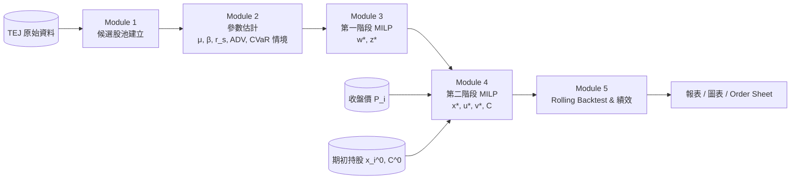

# 主題型股票投資之兩階段再平衡決策支援系統 — 開發計畫

> 本文件是給 4 人組共同遵循的開發藍圖。請依「四人分工」章節各自負責的模組推進，並嚴格遵守「介面契約」一節定義的資料交換格式。

---

## 1. 專案總覽

本專案以 **作業研究中的混合整數線性規劃 (MILP)** 為核心，建立一套針對台股的「主題型 + 風險可控 + 可實際下單」的兩階段再平衡決策支援系統。系統會：

1. 從 **TEJ 台灣經濟新報** 取得歷史價格、成交量、產業分類、市值、Beta、財務指標等。
2. 在 **第一階段** 用 MILP 解出「理想連續權重組合」$w_i^\star$ 與「持股二元決策」$z_i^\star$，同時滿足產業集中度、Beta、流動性、周轉率、CVaR 等限制。
3. 在 **第二階段** 用 MILP 將理想權重 **落地到整數張數**（台股最小交易單位為「張」，1 張 = 1000 股），考慮手續費、現金平衡、單檔持有上下限後產出可直接下單的 order sheet。
4. 用 **rolling rebalance 回測** 與 3 個 benchmark（Top-K 等權、單階段連續權重、本研究兩階段）比較績效。

**最終交付**：可重現的 Python 程式碼、回測報告 PDF、簡報、現場 demo。

---

## 2. 模型本質澄清（重要）

> **本專案是 MILP，不是 NLP。** 所有看起來「非線性」的部分都已被線性化，整個最佳化問題可以用 Gurobi / CBC / CPLEX 等 MILP solver 直接求解。

下表把每個可能被誤判為非線性的部分逐一拆解：

| 看似非線性處 | 實際處理 | 線性化技巧 |
|---|---|---|
| Beta 限制 $\sum_i \beta_i w_i \leq \beta^{\max}$ | $\beta_i$ 是常數（事前回歸估出），不是變數 | 本身就是線性 |
| 期望報酬目標 $\max \sum_i \mu_i w_i$ | $\mu_i$ 是常數（吸引力分數） | 本身就是線性 |
| CVaR 限制 | 用 Rockafellar-Uryasev 表示法引入 $\eta \in \mathbb{R}$ 與 $\xi_s \geq 0$ | $\xi_s \geq -\sum_i r_{i,s} w_i - \eta$；$\eta + \tfrac{1}{(1-\alpha)\lvert\Omega\rvert}\sum_s \xi_s \leq \bar{C}^{\text{risk}}$ |
| 周轉率 $\sum_i \lvert w_i - w_i^0 \rvert$ | 引入 $\delta_i^+,\delta_i^- \geq 0$ | $w_i - w_i^0 = \delta_i^+ - \delta_i^-$；$\sum_i(\delta_i^+ + \delta_i^-) \leq \tau$ |
| 持股上下限 + 選股二元 | 引入 $z_i \in \{0,1\}$ | $L z_i \leq w_i \leq U z_i$（big-M 自然蘊含於 $U \leq 1$） |
| 第二階段 L1 偏離 $\lvert P_i x_i / V^0 - w_i^\star \rvert$ | 引入 $d_i \geq 0$ | $d_i \geq P_i x_i / V^0 - w_i^\star$ 且 $d_i \geq w_i^\star - P_i x_i / V^0$ |
| 整數張數 | $x_i, u_i, v_i \in \mathbb{Z}_{\geq 0}$ | 本身就是整數變數，MILP 直接支援 |
| 買賣互斥 + 固定交易成本 | $B_i, Q_i \in \{0,1\}$，$u_i \leq \bar{u}_i B_i$，$v_i \leq x_i^0 Q_i$，$B_i + Q_i \leq 1$ | 標準的 indicator 線性化 |

**結論**：兩階段都是 MILP。第一階段變數規模 $\mathcal{O}(\lvert I\rvert + \lvert \Omega \rvert)$，第二階段變數規模 $\mathcal{O}(\lvert I\rvert)$，對於 $\lvert I \rvert \approx 50\text{–}100$、$\lvert \Omega \rvert \approx 250$ 的規模，現代 solver 秒級可解。

---

## 3. 系統架構與模組劃分

對應 PDF 的 Module 1~5：

```
Module 1: 候選股池建立  ─┐
                          ├──► Module 2: 參數估計 ──► Module 3: 第一階段 MILP ──► Module 4: 第二階段 MILP ──► Module 5: 回測 & 績效
TEJ 原始資料           ─┘                          (理想 w*, z*)            (整數 x*, order sheet)       (rolling, benchmark, 報表)
```

### Mermaid 資料流圖



### 模組職責

| 模組 | 輸入 | 處理 | 輸出 |
|---|---|---|---|
| **Module 1 候選股池** | TEJ 上市櫃清單、產業分類、市值、ADV | 主題篩選（如：高股息、AI、ESG）+ 流動性篩選 + 市值門檻 | `candidates.parquet`（含 stock_id, industry, market_cap, ADV）|
| **Module 2 參數估計** | Module 1 輸出 + 歷史價格與財務 | μ_i（動能或營收成長分數）、β_i（滾動回歸）、r_{i,s} 歷史報酬矩陣、ℓ_i 流動性上限 | `params.parquet` + `scenarios.parquet` |
| **Module 3 第一階段 MILP** | Module 2 輸出 + 設定檔（K, L, U, γ, β^max, τ, α, C̄^risk） | 建模 → 求解 → 解析 | `ideal_portfolio.json`：$w_i^\star, z_i^\star$ |
| **Module 4 第二階段 MILP** | Module 3 輸出 + 期初狀態（x_i^0, C^0, P_i, V^0, c_b, c_s, λ_trade） | 整數張數模型 → 求解 | `order_sheet.csv`：u_i, v_i, x_i, C 之餘 |
| **Module 5 回測 & 績效** | 全期歷史價格 + 各 rebalance 時點的 Module 3/4 結果 | Rolling rebalance、計算 NAV、benchmark、指標 | `backtest_report.html` + 圖表 + 表格 |

---

## 4. 技術棧建議

| 類別 | 工具 | 備註 |
|---|---|---|
| 語言 | Python 3.11+ | 全組統一版本，建議用 `pyenv` |
| 套件管理 | `uv` 或 `poetry` | 鎖定 `pyproject.toml` |
| 資料處理 | `pandas`, `numpy`, `pyarrow` | parquet 為主要中介格式 |
| 最佳化 | **Gurobi 11**（學術授權免費）為主，**PuLP + CBC** 為備援 | Gurobi 學術授權每人免費，需綁定學校 email |
| 統計回歸 | `statsmodels`, `scikit-learn` | Beta 滾動回歸 |
| TEJ 存取 | TEJ Python API / TEJ Web 下載 CSV | 視組員可用授權而定 |
| 視覺化 | `matplotlib`, `plotly`, `seaborn` | 回測曲線、權重熱圖 |
| 報告 | `jupyter` + `nbconvert`，最終 PDF 用 LaTeX | 與 `Midterm_Project/midtermProject_report.tex` 整合 |
| 版本控制 | git + GitHub Private repo | branch 命名 `feat/<module>/<owner>` |
| 測試 | `pytest` | 至少對線性化邏輯與 schema 寫單元測試 |

---

## 5. 資料來源與 TEJ 欄位對應

> 假設使用 TEJ Database 內常見的資料表名稱（實際表名請以授權當下為準）。

| 模型參數 | 中文 | TEJ 資料表 / 欄位 | 預處理 |
|---|---|---|---|
| 候選股清單 $I$ | 主題股票池 | 「TWSE/TPEx 上市櫃基本資料」+「TEJ 產業分類」 | 依主題（如 TEJ 產業代碼、ESG 評等）篩選 |
| 產業群組 $S_j$ | 產業分類 | TEJ「TSE 新產業」或「TEJ 主產業」欄位 | 建立 stock_id → industry 對照表 |
| 收盤價 $P_i$ | 日收盤 | 「日收盤行情」`close_price` | 還原權息（adj_close） |
| 報酬情境 $r_{i,s}$ | 歷史日/週報酬 | 同上，取 lookback window（例：250 日） | $r = \ln(P_t / P_{t-1})$；NaN 處理 |
| Beta $\beta_i$ | 系統風險 | 自行用 $r_i$ vs TAIEX 回歸 | 60/120 日滾動 OLS，去極端值 |
| 吸引力分數 $\mu_i$ | 預期報酬 / 動能 / 主題分數 | 動能：過去 N 個月報酬；或財務面「營收成長率」、「ROE」 | 標準化（z-score 或 rank-based） |
| 流動性上限 $\ell_i$ | 單檔權重上限 | 「日成交金額 ADV20」 / 預期 NAV | $\ell_i = \min(U, k \cdot \text{ADV}_i / V^0)$，k 為參與率（如 0.1） |
| 市值門檻 | 篩選 | 「市值」 | 例：> 50 億 |
| 期初持股 $x_i^0$ | 張數 | 自訂初始狀態（或上一期 backtest 結果） | 第一期可設為 0 |
| 期初現金 $C^0$ | 現金 | 自訂 | 例：1000 萬 |
| 手續費 $c_b, c_s$ | 買 / 賣 | 設定常數 | 台股實務：買 0.1425%、賣 0.1425% + 證交稅 0.3% |
| TAIEX | 市場基準 | 「TAIEX 加權指數」 | 用於 Beta 回歸與 benchmark |

**預處理 pipeline**：
1. 取 raw CSV / API → 存 `data/raw/<date>/`
2. 清洗（缺值、停牌、合併下市）→ 存 `data/processed/<date>/*.parquet`
3. 用 `data/processed/` 作為所有下游模組的唯一輸入

---

## 6. 四人分工

> 每個人負責一個 Module slab，並對自己模組的「輸入 → 程式 → 輸出」全程負責。

| 組員 | 角色 | 負責模組 | 主要檔案 | 輸入 | 輸出 | 預估時程 |
|---|---|---|---|---|---|---|
| **A** | 資料工程 + 候選股池 | Module 1 + Module 2 部分 | `src/data/tej_loader.py`、`src/data/clean.py`、`src/data/candidates.py` | TEJ API / CSV | `data/processed/prices.parquet`、`candidates.parquet` | D1–D4 |
| **B** | 參數估計 | Module 2 主力 | `src/params/mu.py`、`src/params/beta.py`、`src/params/cvar_scenarios.py`、`src/params/liquidity.py` | A 的輸出 | `params.parquet`、`scenarios.parquet` | D3–D7 |
| **C** | 第一階段 MILP | Module 3 | `src/stage1/model.py`、`src/stage1/solve.py`、`src/stage1/config.yaml` | B 的輸出 + config | `ideal_portfolio.json`（$w^\star, z^\star$） | D3–D9 |
| **D** | 第二階段 MILP + 回測 | Module 4 + Module 5 | `src/stage2/model.py`、`src/stage2/solve.py`、`src/backtest/engine.py`、`src/backtest/metrics.py`、`src/backtest/plots.py` | C 的輸出 + 期初狀態 + 全期 prices | `order_sheet.csv`、`backtest_report.html` | D3–D12 |

### 各人詳細工作包

**A — 資料工程 + 候選股池**
- [ ] 設定 TEJ 帳號 / API key（與全組共用憑證放 `.env`，git ignore）
- [ ] 寫 `tej_loader.py`：能下載指定日期區間的價格、成交量、產業、市值、Beta 原始資料
- [ ] 寫 `clean.py`：處理還原權息、合併下市、停牌補值（forward fill 上限 3 日，否則 drop）
- [ ] 寫 `candidates.py`：給定主題（如「高股息」）→ 篩出候選股 ID 清單，輸出 `candidates.parquet`
- [ ] 為下游所有人準備「示例日期切片」資料以利平行開發

**B — 參數估計**
- [ ] `mu.py`：實作至少 2 種 μ_i 計算方式（動能版、財務版），允許設定切換
- [ ] `beta.py`：60/120 日滾動 OLS 計算 Beta，產出每檔每日 Beta，rebalance 日取最新值
- [ ] `cvar_scenarios.py`：建立 $\lvert\Omega\rvert$ 個歷史情境，每個情境是某一交易日的 $(r_i)_{i\in I}$ 向量；支援「全期等權」與「block bootstrap」兩種抽樣
- [ ] `liquidity.py`：計算 ADV20 與 $\ell_i$
- [ ] 輸出統一為 `params.parquet`（每檔一列）+ `scenarios.parquet`（行：情境，欄：股票）

**C — 第一階段 MILP**
- [ ] 用 Gurobi 寫 `model.py`：定義變數、限制、目標
- [ ] CVaR 線性化（請參照第 2 節）
- [ ] 周轉率線性化
- [ ] 寫 `config.yaml`：暴露所有可調參數（K, L, U, γ_j, β^max, τ, α, C̄^risk, λ_turnover）
- [ ] 寫 `solve.py`：讀 params → 建模 → 求解 → 輸出 `ideal_portfolio.json`
- [ ] 處理不可行時的 fallback：回傳「最接近可行」的 relaxed solution + 違反限制報告

**D — 第二階段 MILP + 回測**
- [ ] `stage2/model.py`：實作整數張數模型，含 L1 線性化、買賣互斥、現金非負
- [ ] `stage2/solve.py`：吃 stage1 輸出 + 期初狀態，輸出 `order_sheet.csv`
- [ ] `backtest/engine.py`：rolling rebalance loop（每月或每季調倉），呼叫 stage1+stage2，更新 portfolio state
- [ ] `backtest/metrics.py`：累積/年化報酬、波動、Sharpe、Max Drawdown、周轉率、現金占比、實際 vs 理想偏離
- [ ] `backtest/plots.py`：NAV 曲線、權重 heatmap、回撤圖、benchmark 對比
- [ ] 實作 3 個 benchmark：(1) Top-K 等權 (2) 單階段連續權重（無整數約束） (3) 本研究兩階段

---

## 7. 介面契約（Interface Contracts）

> **這是 4 人協作的命脈**。任何 schema 改動必須先發 PR 討論。

### 7.1 `data/processed/prices.parquet`
| 欄位 | 型別 | 說明 |
|---|---|---|
| date | datetime64[ns] | 交易日 |
| stock_id | str | 證券代碼（如 "2330"） |
| close | float64 | 還原權息收盤價 |
| volume | int64 | 成交量（股） |
| amount | float64 | 成交金額（元） |

### 7.2 `data/processed/candidates.parquet`
| 欄位 | 型別 | 說明 |
|---|---|---|
| stock_id | str | 證券代碼 |
| name | str | 證券名稱 |
| industry | str | 產業群組 j |
| market_cap | float64 | 市值（元） |
| theme_tag | str | 主題標籤（"high_div" / "ai" / ...） |

### 7.3 `data/processed/params.parquet`
| 欄位 | 型別 | 說明 |
|---|---|---|
| stock_id | str | |
| mu | float64 | 吸引力分數 μ_i |
| beta | float64 | β_i |
| liquidity_cap | float64 | ℓ_i ∈ [0, 1] |
| w0 | float64 | 期初權重 |
| industry | str | 產業 |

### 7.4 `data/processed/scenarios.parquet`
- index: scenario_id（0..|Ω|-1）
- columns: stock_id
- values: r_{i,s}（小數，例 0.012 表示 +1.2%）

### 7.5 `output/ideal_portfolio.json`（Stage1 → Stage2）
```json
{
  "as_of": "2026-04-30",
  "objective_value": 0.0231,
  "weights": {"2330": 0.10, "2317": 0.07, "...": 0.0},
  "selected": ["2330", "2317", "..."],
  "diagnostics": {
    "active_constraints": ["industry_cap_TECH", "beta_max"],
    "cvar_realised": 0.038,
    "turnover_realised": 0.18
  }
}
```

### 7.6 `output/order_sheet.csv`（Stage2 → 下單 / 回測）
| 欄位 | 說明 |
|---|---|
| stock_id | |
| price | $P_i$ |
| x0_lots | 期初張數 $x_i^0$ |
| buy_lots | $u_i$ |
| sell_lots | $v_i$ |
| x_lots | 期末張數 $x_i$ |
| weight_actual | $P_i x_i / V^0$ |
| weight_ideal | $w_i^\star$ |
| deviation | $d_i$ |
| cash_after | C |

### 7.7 設定檔 `config.yaml`（Stage1 + Stage2 共用）
```yaml
universe:
  theme: "high_div"
  min_market_cap: 5.0e9
stage1:
  K: 20
  L: 0.01
  U: 0.10
  gamma:
    TECH: 0.40
    FIN:  0.30
    OTHER: 0.30
  beta_max: 1.1
  turnover_max: 0.30
  alpha: 0.95
  cvar_max: 0.05
stage2:
  c_buy:  0.001425
  c_sell: 0.004425   # 0.1425% + 0.3% tax
  lambda_trade: 0.0005
  V0: 1.0e7
backtest:
  start: "2020-01-01"
  end:   "2025-12-31"
  rebalance_freq: "M"   # M=月,Q=季
```

---

## 8. 時程規劃（2 週衝刺 Milestone）

> 全期 14 天（D1 = 2026-05-18 一），critical path 壓縮。後 4 人 **必須平行開發**：B/C/D 不等 A 完整資料，先用 toy data + mock schema 開工，A 一交付實資料就即時 plug in。

### 8.1 週次概覽

| 週次 | 日期區間 | 主要產出 | 主責 |
|---|---|---|---|
| **Week 1**（衝刺期）| 5/18–5/24 | 全部模組「toy data 可跑通」end-to-end，介面契約凍結 | A 領頭、全員平行 |
| **Week 2**（整合期）| 5/25–5/31 | 實資料跑完整 universe，rolling backtest 完成，報告與 demo | C/D 領頭、全員 |

### 8.2 14 日詳細甘特

| Day | 日期 | A（資料） | B（參數） | C（Stage1）| D（Stage2 + 回測）| 共同里程碑 |
|---|---|---|---|---|---|---|
| D1 | 5/18 一 | 環境就緒、TEJ 帳號接通、抓 sample CSV | 環境就緒、設計 μ/β 公式 | 環境就緒、Gurobi 授權測試 | 環境就緒、Gurobi 授權測試 | **§7 介面契約 v1.0 凍結** |
| D2 | 5/19 二 | `tej_loader.py` 完成、`prices.parquet` 雛形 | `mu.py` toy 版 | `stage1/model.py` 骨架（不含 CVaR）| `stage2/model.py` 骨架 | repo + CI 就緒 |
| D3 | 5/20 三 | `clean.py` 完成（還原權息）| `beta.py` 完成、滾動 OLS | CVaR 線性化加入 | L1 偏離 + 買賣互斥加入 | — |
| D4 | 5/21 四 | `candidates.py` 完成、`candidates.parquet` 交付 | `cvar_scenarios.py` + `liquidity.py` | Stage1 toy case 可解（10 檔 × 30 情境）| Stage2 toy case 可解 | **Toy 端到端跑通** |
| D5 | 5/22 五 | 全期 prices.parquet 完成（5 年）| `params.parquet` toy 版完成 | 周轉率限制 + fallback 機制 | `backtest/engine.py` 骨架 | 週五 21:00 同步會 |
| D6 | 5/23 六 | 資料 QA、cross-check | `scenarios.parquet` 完成（≥250 情境）| Stage1 完整限制全上 | `metrics.py`（Sharpe/MDD 等）| — |
| D7 | 5/24 日 | 緩衝 / 支援 B、C | **B 全部交付**、sanity check | Stage1 跑「小 universe」（30 檔）✓ | Stage2 整合 Stage1 輸出 | **W1 收尾：W2 起切實資料** |
| D8 | 5/25 一 | 待命修補資料 bug | 支援 C 調 μ/β | Stage1 跑「完整 universe」（~80 檔）✓ | rolling backtest loop 完成 | — |
| D9 | 5/26 二 | — | — | Stage1 多參數測試（不同 K, γ）| 3 個 benchmark 全部實作完 | — |
| D10 | 5/27 三 | — | — | 緩衝 / 支援 D | Backtest 跑完 5 年、產生 NAV 曲線 | **整體成果初稿** |
| D11 | 5/28 四 | 報告：資料章節 | 報告：參數章節 | 報告：Stage1 章節 + 敏感度分析 | 報告：Stage2 + 回測章節、`plots.py` | — |
| D12 | 5/29 五 | 報告整合 | 報告整合 | 報告整合 | 報告整合、敏感度 scan | 週五 21:00 同步會 |
| D13 | 5/30 六 | 簡報製作 | 簡報製作 | 簡報製作 | 簡報製作、demo 流程演練 | — |
| D14 | 5/31 日 | 最終 QA、PDF 匯出 | 同左 | 同左 | 同左 | **Code freeze + 交付** |

### 8.3 critical path 與風險吸收

- **Critical path**：A.D4 (candidates) → B.D7 (params/scenarios) → C.D8 (Stage1 完整跑) → D.D10 (backtest 跑完) → 報告 D11–D14。
- **平行化要點**：D1–D2 全員用 mock schema 起跑，**不要等資料**。介面契約 (§7) 在 D1 凍結是關鍵。
- **緩衝**：D14 留作純整合 / debug，禁止加新功能。任何 D11 以後想加的功能列入「未來工作」章節。
- **同步節奏**：D1、D5、D7、D10、D12 五次站立會（15 分鐘）；D5 與 D12 加深度同步（60 分鐘）。

---

## 9. 風險與緩解

| 風險 | 影響 | 緩解 |
|---|---|---|
| TEJ 授權 / 額度限制 | 拿不到完整歷史 | 提早申請；備援用 yfinance + 公開資料補；先用小 universe 跑通 pipeline |
| Gurobi 學術授權審核延遲 | Stage1 卡住 | 同步在 `solve.py` 寫 PuLP + CBC backend；用 strategy pattern 切換 solver |
| 第一階段不可行 | Stage2 無輸入 | 設計「relax 機制」：放寬 CVaR 或產業限制，回傳 slack；diagnostics 必填 |
| Look-ahead bias（前視偏誤） | 回測過度樂觀 | 嚴格規定：rebalance 日 t 只能用 ≤ t-1 的資料；單元測試檢查 |
| 還原權息錯誤 | 報酬計算錯 | 用兩個資料源交叉驗證；對知名股票（2330）手動 sanity check |
| 整數張數 + 高股價導致不可行 | Stage2 infeasible | 允許 stage2 引入 slack 變數，目標加大懲罰；或臨時提高 V^0 |
| CVaR 情境集合太小 | 風險低估 | $\lvert\Omega\rvert \geq 250$；用 block bootstrap 擴增 |
| 多人 schema 衝突 | 整合卡關 | §7 介面契約凍結；任何改動發 PR + tag 全員 |
| 報告與程式不同步 | demo 翻車 | W6 前最後一次 freeze code；報告引用的數字必須能用 commit hash 重現 |

---

## 10. 交付清單

### 10.1 程式碼結構（建議）

```
114-2_OR_Mid_Project/
├── README.md
├── 開發計畫.md                  # ← 本文件
├── pyproject.toml
├── .env.example
├── config.yaml
├── src/
│   ├── data/
│   │   ├── tej_loader.py
│   │   ├── clean.py
│   │   └── candidates.py
│   ├── params/
│   │   ├── mu.py
│   │   ├── beta.py
│   │   ├── cvar_scenarios.py
│   │   └── liquidity.py
│   ├── stage1/
│   │   ├── model.py
│   │   └── solve.py
│   ├── stage2/
│   │   ├── model.py
│   │   └── solve.py
│   ├── backtest/
│   │   ├── engine.py
│   │   ├── metrics.py
│   │   └── plots.py
│   └── common/
│       ├── schemas.py           # pandera / pydantic schema
│       └── io.py
├── notebooks/
│   ├── 01_data_eda.ipynb        # A
│   ├── 02_param_sanity.ipynb    # B
│   ├── 03_stage1_demo.ipynb     # C
│   ├── 04_stage2_demo.ipynb     # D
│   └── 05_backtest_report.ipynb # D
├── data/
│   ├── raw/
│   └── processed/
├── output/
│   ├── ideal_portfolio.json
│   ├── order_sheet.csv
│   └── backtest_report.html
├── reports/
│   ├── final_report.tex
│   └── slides.pptx
└── tests/
    ├── test_schemas.py
    ├── test_stage1.py
    └── test_stage2.py
```

### 10.2 報告章節對應

| 報告章節 | 對應模組 / 程式 |
|---|---|
| 問題背景與動機 | — |
| 文獻回顧 | — |
| 模型建構（Stage1） | `src/stage1/model.py` |
| 模型建構（Stage2） | `src/stage2/model.py` |
| 資料與參數 | `src/data/`, `src/params/` |
| 回測結果 | `notebooks/05_backtest_report.ipynb` |
| 敏感度分析 | K, γ, β^max, τ, α scan（D 負責） |
| 結論與未來工作 | — |

### 10.3 Demo 需準備
- 從 `config.yaml` 改 K 或產業上限 → 即時跑 Stage1 → 顯示 w*
- 同一個 ideal portfolio 用兩個不同 V^0 跑 Stage2 → 顯示張數差異
- Backtest NAV 曲線與 benchmark 對比

---

## 11. 下一步行動（Action Items）

> 2 週衝刺，所有準備動作壓到 **D1（5/18）以前**完成，否則 critical path 立刻延期。

| # | 行動 | 負責人 | 截止 |
|---|---|---|---|
| 1 | 申請 Gurobi 學術授權（4 人各自申請，需學校 email）| 全員 | **5/17 今天** |
| 2 | 確認 TEJ 授權範圍、取一張 sample CSV 測試讀檔 | A | **5/18 D1 上午** |
| 3 | 初始化 repo 結構、`pyproject.toml`、`.env.example`、pre-commit | A 或 D | **5/18 D1 上午** |
| 4 | 凍結 §7 介面契約 v1.0，全員 ack（不接受 W1 內變動）| 全員 | **5/18 D1 晚上** |
| 5 | 用 toy data（10 檔股 × 30 情境）跑通 Stage1 + Stage2 end-to-end | C + D | **5/21 D4 晚上** |
| 6 | A 交付完整 5 年實資料 `prices.parquet` | A | **5/22 D5** |
| 7 | B 交付 `params.parquet` + `scenarios.parquet`（≥250 情境）| B | **5/24 D7** |
| 8 | Stage1 跑完整 universe（~80 檔）成功 | C | **5/25 D8** |
| 9 | Rolling backtest 跑完 5 年、NAV 曲線出爐 | D | **5/27 D10** |
| 10 | Code freeze、最終 PDF 報告 + 簡報交付 | 全員 | **5/31 D14** |

---

## 附錄 A：兩階段模型完整公式速查

**Stage 1（理想連續權重）**
$$
\begin{aligned}
\max_{w, z, \delta^\pm, \eta, \xi} \quad & \sum_{i\in I} \mu_i w_i \\
\text{s.t.}\quad & \sum_{i\in I} w_i = 1 \\
& \sum_{i\in I} z_i = K \\
& L\, z_i \leq w_i \leq U\, z_i, && \forall i \\
& w_i \leq \ell_i, && \forall i \\
& \sum_{i\in S_j} w_i \leq \gamma_j, && \forall j \\
& \sum_{i\in I} \beta_i w_i \leq \beta^{\max} \\
& w_i - w_i^0 = \delta_i^+ - \delta_i^-,\; \delta_i^\pm \geq 0, && \forall i \\
& \sum_{i\in I}(\delta_i^+ + \delta_i^-) \leq \tau \\
& \xi_s \geq -\sum_{i\in I} r_{i,s} w_i - \eta,\; \xi_s \geq 0, && \forall s \in \Omega \\
& \eta + \tfrac{1}{(1-\alpha)\lvert\Omega\rvert}\sum_{s\in\Omega} \xi_s \leq \bar{C}^{\text{risk}} \\
& w_i \geq 0,\; z_i \in \{0,1\}, && \forall i
\end{aligned}
$$

**Stage 2（整數張數落地）**
$$
\begin{aligned}
\min_{x, u, v, C, B, Q, d} \quad & \sum_{i\in I} d_i + \lambda_{\text{trade}} \sum_{i\in I} (B_i + Q_i) \\
\text{s.t.}\quad & x_i = x_i^0 + u_i - v_i, && \forall i \\
& C = C^0 + \sum_i P_i v_i (1 - c_s) - \sum_i P_i u_i (1 + c_b),\; C \geq 0 \\
& d_i \geq P_i x_i / V^0 - w_i^\star, && \forall i \\
& d_i \geq w_i^\star - P_i x_i / V^0, && \forall i \\
& L_i^{\text{lot}}\, z_i^\star \leq x_i \leq U_i^{\text{lot}}\, z_i^\star, && \forall i \\
& u_i \leq \bar{u}_i\, B_i,\; v_i \leq x_i^0\, Q_i, && \forall i \\
& B_i + Q_i \leq 1, && \forall i \\
& x_i, u_i, v_i \in \mathbb{Z}_{\geq 0},\; B_i, Q_i \in \{0,1\},\; d_i \geq 0, && \forall i
\end{aligned}
$$

---

*最後更新：2026-05-17*
